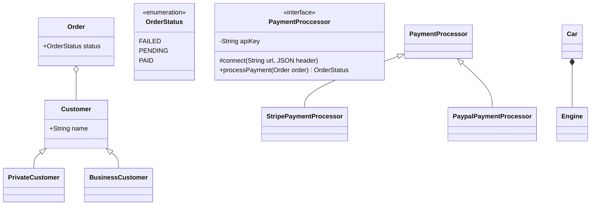
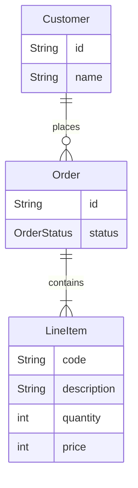
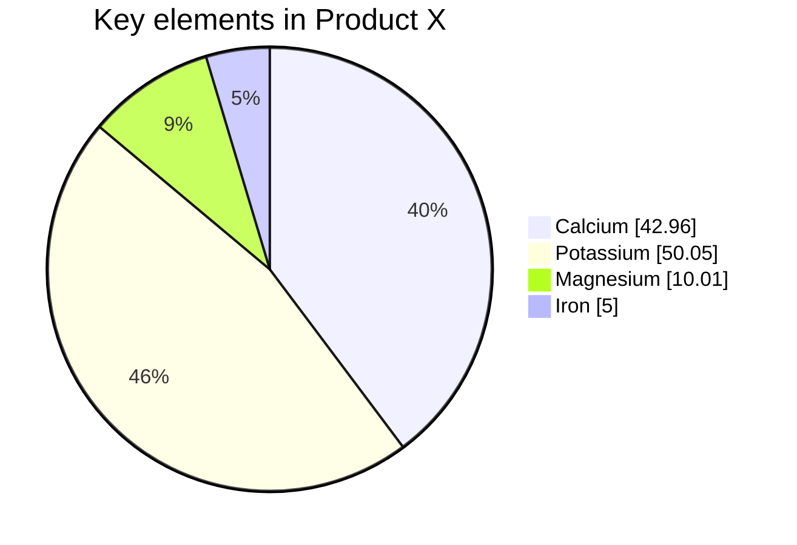

# Just testing Mermaid diagrams :)

```mermaid
flowchart
  A --> B
````

---
Sequence diagram
```mermaid
sequenceDiagram
  autonumber
  participant Client
  participant OAuthProvider
  participant Server
  Client ->> OAuthProvider: Request access token
  activate OAuthProvider
  OAuthProvider->>Client: Send access token
  deactivate OAuthProvider
  Client->>Server: Request resource
  activate Server
  Server->>OAuthProvider: Validate token
  activate OAuthProvider
  OAuthProvider->>Server: Token valid
  deactivate OAuthProvider
  Server->>Client: Send results
  deactivate Server
```


---
Class diagram


---
E-R Diagram




```mermaid
flowchart LR
  S[Start] --> A;
  A(Enter your email address) --> B{Existing user?};
  B --> |No| C(Enter name)
  C --> D{Accept conditions?}
  D --> |No| A
  D --> |Yes| E(Send email)
  B --> |Yes| E
  E --> End
````
